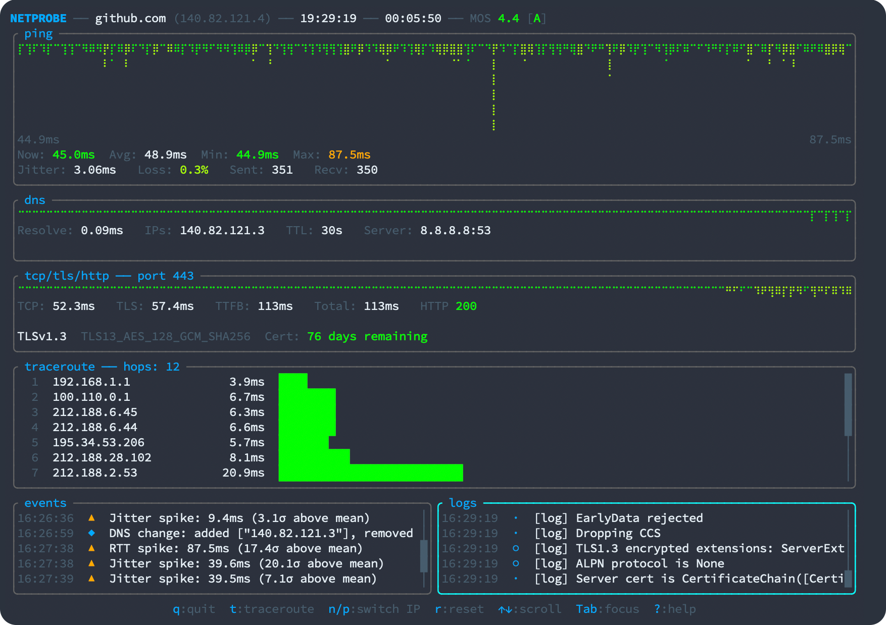

# netprobe

A comprehensive network quality monitoring tool with an interactive TUI dashboard. netprobe performs continuous multi-layer network diagnostics including ICMP ping, DNS resolution, TCP/TLS handshake, HTTP health checks, and traceroute analysis.

Supports Linux, macOS, and Windows.




## Features

- **ICMP Ping Monitoring** - Continuous latency measurement with packet loss detection, jitter calculation, MOS (Mean Opinion Score) grading, and duplicate/reorder detection
- **DNS Resolution Tracking** - Periodic DNS lookups with resolution time measurement, TTL monitoring, multi-IP support, and DNS change detection
- **TCP/TLS/HTTP Probing** - Connection establishment timing, TLS handshake analysis with certificate details (expiry, SAN, issuer), and HTTP response metrics (TTFB, status codes)
- **Traceroute Analysis** - Hop-by-hop path visualization with RTT measurements and hostname resolution
- **Interactive TUI Dashboard** - Real-time visualization with sparklines, statistics panels, keyboard navigation, and IP switching for multi-homed hosts
- **Anomaly Detection** - Automatic detection of RTT spikes, jitter spikes, loss bursts, DNS changes, and certificate expiry warnings
- **Structured Logging** - JSONL output with session start/end records for analysis and auditing
- **Quiet Mode** - Background operation without TUI for automated monitoring
- **Customizable Intervals** - Configurable probe frequencies and timeouts for all check types
- **Cross-Platform** - Supports Linux, macOS, and Windows with automatic privilege detection

## Quick Start

```bash
# Monitor a domain with default settings
netprobe example.com

# Monitor an IP address
netprobe 1.1.1.1

# Quiet mode with logging to file
netprobe example.com -q --log output.jsonl

# Custom HTTP path and port
netprobe example.com --port 8080 --http-path /health

# Disable HTTP probing, ICMP only
netprobe example.com --no-http

# Use plain HTTP instead of HTTPS
netprobe example.com --no-tls --port 8080

# Custom DNS server for resolution
netprobe example.com --dns-server 8.8.8.8

# Adjust probe intervals
netprobe example.com --interval-icmp 500 --interval-dns 60
```

## Installation

### From Source

```bash
git clone https://github.com/yourusername/netprobe
cd netprobe
cargo build --release
```

The binary will be available at `target/release/netprobe`.

### Privileges

Traceroute functionality requires raw socket access. Without elevated privileges, netprobe will run but traceroute will be disabled.

**Linux:**
```bash
# One-time setup, then run without sudo
sudo setcap cap_net_raw+ep ./netprobe

# Or run with sudo
sudo ./netprobe <target>
```

**macOS:**
```bash
sudo ./netprobe <target>
```

## Documentation

See the [User Guide](docs/USER_GUIDE.md) for detailed documentation on all features, configuration options, and log format specifications.

## License

MIT
